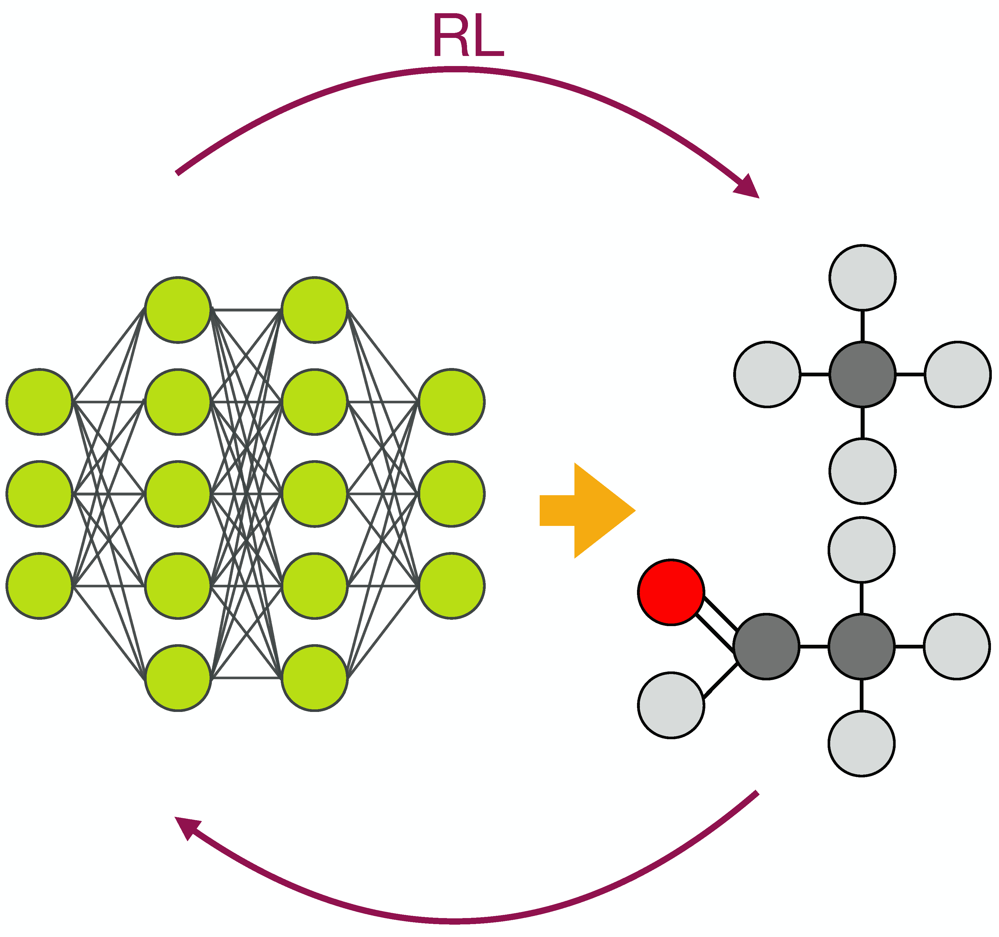

# RL-GraphINVENT



## Description
RL-GraphINVENT is a platform for graph-based targeted molecular generation using graph neural networks and reinforcement learning. RL-GraphINVENT uses a Gated Graph Neural Network -based model fine-tuned using reinforcement learning to probabilistically generate new molecules with desired property profiles.

## Prerequisites
* Anaconda or Miniconda with Python 3.6 or 3.8.
* CUDA-enabled GPU.

## Usage
To generate targeted molecules using the RL-GraphINVENT:
* Pre-train GraphINVENT in a supervised learning manner using a general molecular dataset.
* Define a scoring function based on a set of desired molecular properties. This score should assign high scores to the set of actions taken to build molecules with the desired attributes.
* Use the RL framework to fine-tune the pre-trained model towards generation of molecules with the desired properties.
* Analyse the properties of the generated molecules.

To generate molecules with other properties or use a different scoring function, one can go back to step 2 and repeat the process for the same pre-trained model.

### Pre-training
There are 6 different kinds of jobs for the pre-training phase:
* "preprocess": for generating the target Action-Probability Distributions (APDs) of each sub-graph of the molecules in the dataset.
* "train" : for pre-training the generative model so that it learns to generate molecules which properties resemble those of the molecules in the training data.
* "generate": for sampling molecules from a chosen trained model.
* "test": for computing the evaluation metrics on the test set.
* "multiple_valid": for reevaluating the model at different training epochs.
* "valid_loss": for computing the validation loss of the model at different epochs.

### Fine-tuning
There are 2 different kinds of jobs for the fine-tuning phase:
* "learn": for fine-tuning the model via reinforcement learning with the defined scoring function
* "generate": for sampling molecules from a chosen model.

The scoring functions are defined in [scores.py](./fine-tuning/scores.py).

## Contributors
[@sararromeo](https://www.github.com/sararromeo)

[@rociomer](https://www.github.com/rociomer)

[@JuanViguera](https://www.github.com/JuanViguera)

[@psolsson](https://www.github.com/psolsson)

## Contributions

Contributions are welcome in the form of issues or pull requests. To report a bug, please submit an issue.


## Related work
### GraphINVENT
The implementation of GraphINVENT adapted for this work was pulled from the MolecularAI repo in January 2021. It is available at

https://github.com/MolecularAI/GraphINVENT

This work is explained in [publication](https://doi.org/10.1088/2632-2153/abcf91).


### Data
The data used for pre-training the generative model and for checking the overlap between generated molecules and known 'true' actives is a subset of the data found in https://github.com/pcko1/Deep-Drug-Coder/tree/master/datasets.

### DRD2 activity QSAR model
The model used for the activity scoring function can be found at https://github.com/pcko1/Deep-Drug-Coder/blob/master/models/qsar_model.pickle.


## License

RL-GraphINVENT is licensed under the MIT license and is free and provided as-is.

## Setting up the environment
Before doing anything with RL-GraphINVENT, you will need to configure the RL-GraphINVENT virtual environment, as the code is dependent on very specific versions of packages. You can use [conda](https://docs.conda.io/en/latest/) for this.

The [../environment.yml](../environment.yml) file lists all the packages required for GraphINVENT to run. From within the [RL-GraphINVENT/](../) directory, a virtual environment can be easily created using the YAML file and conda by typing into the terminal:

```
conda env create -f environment.yml
```

Then, to activate the environment:

```
conda activate RL-GraphINVENT-env
```

To install additional packages to the virtual environment, should the need arise, use:

```
conda install -n RL-GraphINVENT-env {package_name}
```

To save an updated environment as a YAML file using conda, use:

```
conda env export > path/to/environment.yml
```

And that's it!

